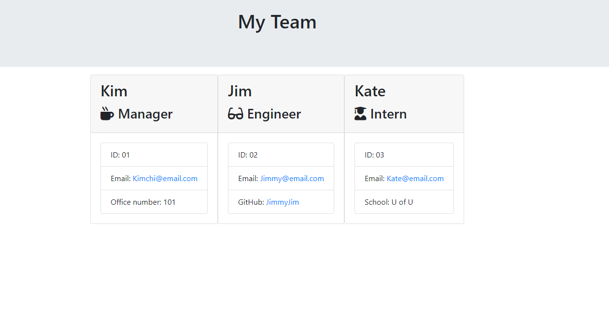

# template-engine


## Description
Template Engine is a Node CLI that takes in information about employees and generates an HTML webpage that displays summaries for each person. The dynamcially generated, formated team roster is created as a `team.html` page in the `output` directory. The motivation behind this application was to quickly generate and display a team's basic information so that their emial or Github profiles can easily be referenced and accessed.  

## Installation
The steps required to install this application are as follows:
 1. Depending on user, open either the Command Prompt, PowerShell, or Terminal. 
 2. Go to the command line and navigate to the appropriate folder houseing the template engine program. 
 3. Run the command line program by typing "node app.js" and pressing Enter
 4. Follow the prompts and questions to generate a team roster using the information provided. 

## Usage
The application will be invoked with the following command:
```
node app.js
```


[Link to video](https://drive.google.com/file/d/1hMBesIUhJ_hmXMnK3WPKb3s-Qe2aYySE/view) demostrating the user flow through the command-line application demostrated above.



Screenshot demostrating the `team.html` generated from the information provided in the demostration GIF.

[Sample Template Engine file](./output/team.html) generated in the demonstration.

## Credits
[Inquirer NPM Package](https://www.npmjs.com/package/inquirer) was used to prompt the user's information, take that input, and dynamically create a html page based on user response. 

[Jest](https://jestjs.io/) was used for running the provided tests. 

A live link to my [Template Engine](https://nikolaslenning.github.io/template-engine/) is hosted on Github pages.

This application was authored by [Nikolas Lenning](https://github.com/nikolaslenning).


